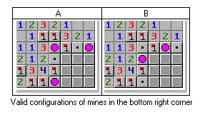

# AI-Minesweeper-

## About Minesweeper
Minesweeper is logic-based game played on rectangular board whose object is to locate a predetermined number of randomly-placed ”mines” in the by clicking on ”safe” squares while avoiding the squares with mines. If the player clicks on a mine, the game ends. Otherwise, a number between 0 and 8 is displayed that identifies the total number of mines present in the eight neighboring squares. Therefore, finding a square containing ”8” indicated that all eight adjacent squares contain mines, while if a zero is uncovered, there are no mines in the surrounding squares. A square suspected of containing a mine may be marked with flag.

## Deeper Analysis

While minesweeper can be solved with logic alone in most cases there will be times when logic wont help. Here the agent also known as the player will have to choose a random coordinate and hope luck is on there side by revealing a safe cell.

