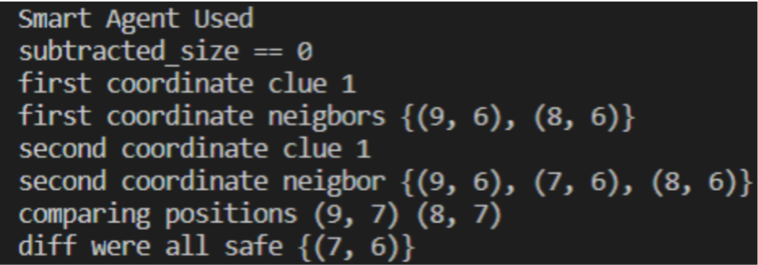
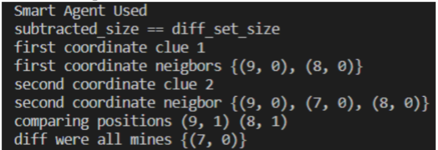
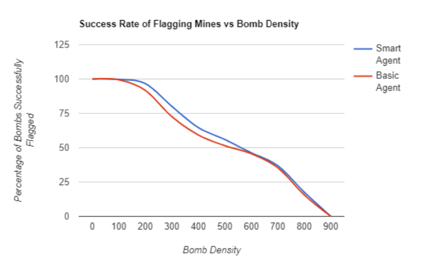

# AI-Minesweeper

## About Minesweeper
Minesweeper is logic-based game played on rectangular board whose object is to locate a predetermined number of randomly-placed ”mines” in the by clicking on ”safe” squares while avoiding the squares with mines. If the player clicks on a mine, the game ends. Otherwise, a number between 0 and 8 is displayed that identifies the total number of mines present in the eight neighboring squares. Therefore, finding a square containing ”8” indicated that all eight adjacent squares contain mines, while if a zero is uncovered, there are no mines in the surrounding squares. A square suspected of containing a mine may be marked with flag.

## Deeper Analysis

While minesweeper can be solved with logic alone in most cases there will be times when logic wont help. Here the agent also known as the player will have to choose a random coordinate and hope luck is on there side by revealing a safe cell.

Here we can see that there are two possible scenarios that can play out here.
The goal is to see if a AI agent can use any other inference before falling back to luck which is choosing a random coordinate due to insufficient knowledge of the board.

## Representation
A board size of n*n dimension size was used with a total of four boards to help infer logic from them. For this report a board size of 30*30 was used with a mine density of [0,100,200,300,400,500,600,700,800,900]. Each mine density ran a total of 10 games. Moreover when the agent unluckily hits a mine it will keep track of the count and continue on instead of ending the game. This will help us gather new findings and see if there are other inferences that can be used on top of logic to help the agent in successfully flagging mines.

The four boards are:
1. Minesweeper Board
      -  Can be known as the “answer key board”
      -  Consists of the adjacent mine count for each cell and for mine cells
it has a value of 9
2. Player Board
      -   Start off with all -1’s and it gets updated every time a new cell is opened by updating the cells -1 with whatever is at those coordinates in the minesweeper board.
    
    
3. Revealed Board
      - Every time a cell is opened on the player board it will get updated here to fully guarantee that it has been a visited cell and the agent was able to deduce everything from it such as updating its knowledge base.
      - 1 means visited while 0 is unvisited
      - The game will continue on until the revealed board has no more 0’s

4. Flagged board
      - Will all have 0’s and the assumed mines will be marked as 1’s
 
### Knowledge Base  
To represent the knowledge base a dictionary was used and for every key,value pair in the dictionary, it was considered a sentence.

Here a sentence in the knowledge base can be read as: 

      - “At (x,y) coordinate, we can infer that there are k coordinates that are unrevealed neighbors and out of them the clue tells us there are m mines within them.”

How it was programmed :

      - Key : coordinate , Value : (clue : mine count , unrevealed neighbors)

## What can the agent infer?
Whenever a new cell is revealed the agent will add it to the knowledge base as a sentence. Once this sentence has been added to the dictionary, it will update its existing sentences in the knowledge base where these new cell coordinates will be removed from those sentences’ unrevealed neighbors. This is being done by the agent because unrevealed neighbors are only supposed to have coordi- nates that haven’t been visited guaranteeing the agent that it will have the most up-to-date information about the board after making that move. When it do this thd agents knowledge base is able to deduce everything it can from every possible move that can happen on the board.

## How the agent makes a decision
The agent starts out by selecting a random coordinate as its first move. If this was a mine it will keep track of the unlucky mine hits it had. Otherwise, it will reveal it on the player board. During the next iteration based on the mine count clue and it being revealed on the player board , the agent will try to see if it can safely reveal more cells or flag mines that are 100 percent true based on logic alone. For instance, if a mine count was 2 and the agent had marked some 2 neighboring cells as flags then theoretically it can open the other 6 possible neighbors with confidence. Likewise, if te agent wasn’t able to deduce any safe cells while analyzing the player board it will try to see if it can use logic to flag any cells as mines that it is 100 percent sure of. For instance, if a cell had a mine count of 5 and 3 have been revealed as safes already then theoretically the rest of the mines are 100 percent mines which can be flagged. If both these logic’s don’t help the agent infer anything it will call a subset check method where we will try to see if any sentences unrevealed neighbors is a sub- set of another sentence in the knowledge base. If it is then the agent will do a little more digging meaning it will do sentence B values minus sentence A values.

For Example:

- Sentence B: “ At coordinate 5,5 we can infer that there are (4,4) ,(5,4) ,(4,6) (5,6), (6,5) , (6,6) coordinates that are unrevealed neighbors and out of them the clue tells us there is 1 mine within them.”

- Sentence A: “ At coordinate 4,5 we can infer that there are (4,4) (5,4) (4,6) (5,6) coordinates that are unrevealed neighbors and out of them the clue tells us there is 1 mine within them.”

- Sentence B - A: We can infer that coordinate (6,5) (6,6) doesn’t have a mine guaranteeing it is 100 percent safe because its mine count will equal to 0
Likewise, if the remaining unrevealed coordinates count matches the clue which isn’t 0 we can infer that it is 100 percent a mine we can flag. The agent will try this subset with each and every element taking O(n2) time.

- If this fails it will fall to its last resort with is selecting a random coordinate to open. Then it will repeat those above steps in that order until the entire board has been revealed with ones in the revealed board.

# Performance
When looking at the play by play the agent was making, all the decisions made were valid as there was no decision that the player would have made differently. The cells were opened only if the smart agent was deemed 100 percent safe. Cells were also marked as flagged only if they were deemed 100 percent as a mine.

First scenario: “ At coordinate (9,7), we can infer that there are 2 (9,6) , (8,6) coordinates that are unrevealed neighbors and out of them the clue tells us there are 1 mines within them.” “ At coordinate (8,7), we can infer that there are 3 (9,6) , (7,6) , (8,6) coordinates that are unrevealed neighbors and out of them the clue tells us there are 1 mines within them.”
When the difference of the clue of both coordinates is 0 (ex:1-1 = 0), with the Smart Agent Method a.k.a. S.A.M (acronym) we are able to infer that the coordinates that are different between both sets will be safe which in this case would be (7,6) and in turn would be revealed on the player board and updated in the knowledge board

Second scenario: “ At coordinate (9,1), we can infer that there are 2 (9,0) , (8,0) coordinates that are unrevealed neighbors and out of them the clue tells us there are 1 mines within them.” “ At coordinate (8,1), we can infer that there are 3 (9,0) , (7,0) , (8,0) coordinates that are unrevealed neighbors and out of them the clue tells us there are 2 mines within them.”
When the difference of the clue of both coordinates is equal to the difference set size between both coordinates (ex: 2 - 1 = 3 - 2), with the Smart Agent Method a.k.a. S.A.M (acronym) we are able to infer that the coordinates that are different coordinate(s) between both sets will be mines which in this case would be (7,0) and in turn would be flagged as a mine on the flagged board.

## AI Agent Performance 

Here the smart agent is using the SAM method on top of logic alone. While the Basic agent was only using logic inferences.

After analyzing the graph It shows that a mine density in range of 0-100 can be solved by using the basic agent alone as it is able to take care of most cases within those mine densities. This is when minesweeper is easy and basic logic alone can be used to infer clues. When we get to the 300-700 mine density range we can analyze that this is when the basic agent can’t infer anything as much and this is also when the minesweeper game becomes “hard.” We can clearly see that the SAM method being used by the smart agent helps improve the success rate for better mine identification. However, from 700-900 percent mine density we see the lines come back close to each other telling us that both the SAM method and basic logic rules aren’t enough to help the agent identify mines. In conclusion mine density which is less than 10 percent of the dim*dim size can be mostly solved with the basic agent. From 10 percent to 70 percent using the smart agent on top of the basic agent can help us identify mines much better. Lastly, if we try to use the smart agent on top of the basic agent from 70 percent and on we see that it doesn’t help us any more than not even using the smart agent at all.

## Efficiency

One of the constraints faced while implementing this is the SAM method being called on when the mine density is above 70 percent. When this happens it seems to not be able to do any more inference hence drastically slowing down the time. However, when the SAM method is used below 70 percent mine den- sity it helps improves our chances of flagging a mine. While the SAM method takes O(n2) time it is being able to infer new findings from doing subsets and being able to draw as much as it can out of every new move that occurs making it as efficient as it can be. Hence while the SAM method is costly it is most definitely worth the extra cost as it gives us new insights from existing data vs gathering new insights from new data and risking hitting a mine.

## Closing Statement

This paper verified using a algorithmic design decision such as the subset method for Minesweeper helps improves chances in successfully flagging a mine. The importance of handling guesses as a last resort in Minesweeper games will always have instances of guessing as that is the beauty of the game. Therefore, it is crucial that player incorporate efficient methods on performing nondeter- ministic moves. The findings gathered has supported the goal statement which was that other strategies can be used before falling to the last resort which is selecting a random coordinate.

## References
Weisstein, Eric W. ”Minesweeper.” From MathWorld–A Wolfram Web Re- source. https://mathworld.wolfram.com/Minesweeper.html

